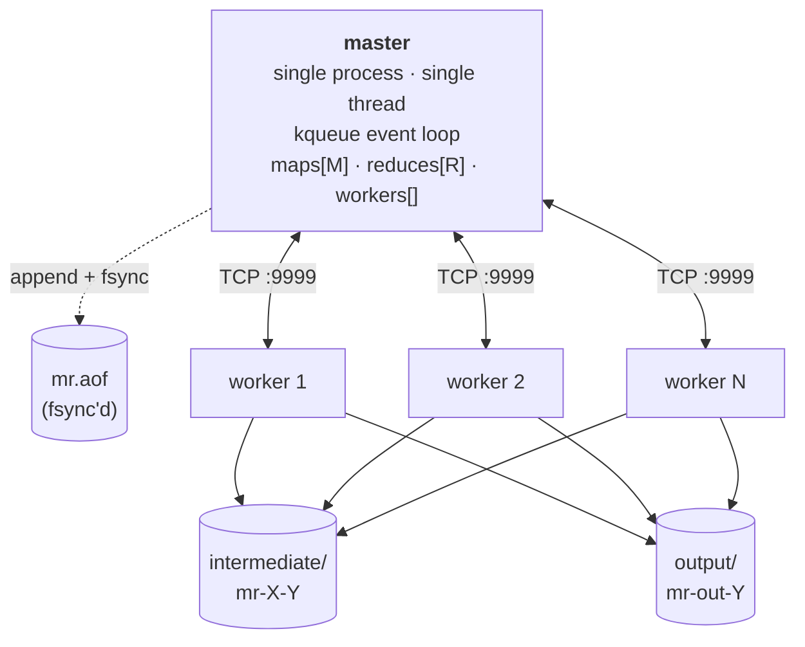
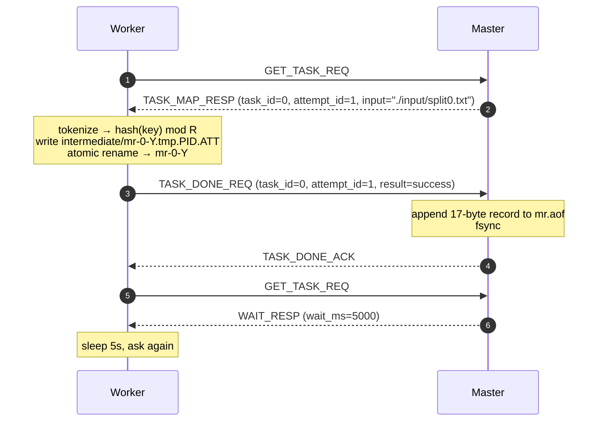
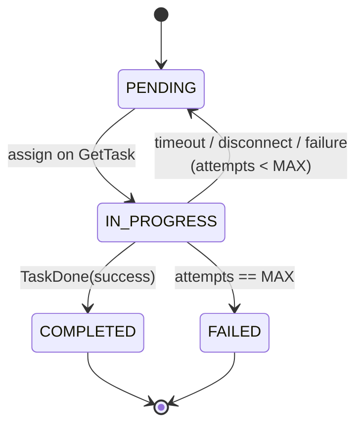

# mapreduce-c

A single-machine implementation of the MapReduce paper, written from scratch in C.
A coordinator process dispatches map and reduce tasks to N workers over a custom
length-prefixed TCP protocol. Workers crash, time out, or come back; the
coordinator reassigns. The coordinator itself can be killed mid-job — it replays
an append-only log on restart and picks up where it left off.

~3.6K lines of C. No dependencies beyond libc.

## Running it

```sh
make                          # builds ./master and ./worker
./master &                    # listens on :9999 by default
./worker                      # one worker; spawn more in extra shells
```

Input splits live in `./input/`, intermediate files in `./intermediate/`, final
output in `./output/`. Bundled workload is word count; three input splits, four
reduce partitions.

```sh
$ cat output/mr-out-*
and     1
brown   2
fox     1
...
```

Settings live in a config file (port, n_reduce, task timeout, AOF path). Run with
defaults or pass a config: `./master mr.conf`.

### Simulating a coordinator crash

```sh
./master &
./worker
# let a few maps complete...
kill -9 $(pgrep '^master$')        # SIGKILL — no clean shutdown

./master                           # restart
# [aof_load] replay complete: M=3 R=4 maps_done=2 reduces_done=0
./worker                           # picks up where it left off
```

The replay line is the recovery proof. The maps that finished before the kill
are not redone; the ones that didn't are reassigned to the new worker.

## Architecture



The master is single-threaded. There are no mutexes anywhere in the master
because there is no thread to race against — the kqueue event loop reads one
event at a time and never blocks. Accept, read, write, and fsync are all either
nonblocking or short enough not to matter.

Workers are blocking clients. A worker sits on a `recv` between tasks. There is
no event loop on the worker side; it's a sequential loop of `get_task → run →
report → ack`.

### Wire format

Every TCP frame is length-prefixed:

```
┌──────────────┬───────────────────────────────────┐
│  4B BE len   │  payload (1B kind, then fields)   │
└──────────────┴───────────────────────────────────┘
```

Seven RPC kinds, exhaustively:

| ID | Direction | Name | Carries |
|---:|-----------|------|---------|
| 1 | W → M | `GET_TASK_REQ`     | (empty) |
| 2 | M → W | `TASK_MAP_RESP`    | task_id, attempt_id, n_reduce, input_path |
| 3 | M → W | `TASK_REDUCE_RESP` | task_id, attempt_id, n_map |
| 4 | M → W | `WAIT_RESP`        | wait_ms |
| 5 | M → W | `DONE_RESP`        | (empty — go home) |
| 6 | W → M | `TASK_DONE_REQ`    | task_id, attempt_id, result |
| 7 | M → W | `TASK_DONE_ACK`    | (empty) |

`attempt_id` is the lever that makes timeouts safe. If task 3 times out and gets
reassigned to a new worker as attempt 2, and the original worker (zombie) wakes
up and reports attempt 1 succeeded — the master drops it. Stale completions
can't poison fresh state.

All multi-byte fields are big-endian. Maximum frame payload is 4 KiB.

A happy-path exchange — worker picks up a map task, runs it, reports done:



When all maps finish, the master flips its phase to `JOB_REDUCE` and the next
`GET_TASK_REQ` returns a `TASK_REDUCE_RESP` instead. When all reduces finish,
`DONE_RESP` and the worker exits.

### Task lifecycle



Failure is modelled as a counter on the task, not a separate object per attempt.
The scheduler only cares about (current state, attempts used so far); past
attempts are kept in a bounded ring buffer for logs, not for control flow. This
keeps the state machine four states wide instead of fanning out per attempt.

A bounded per-task history (size 3) records who tried it, when, and why each
attempt ended (success, failure, timeout, disconnect). Useful when debugging,
ignored by the scheduler.

## Crash recovery

The most interesting subsystem in the project, so worth walking through.

The master persists exactly one thing: an append-only log of completed tasks at
`mr.aof`. When a worker reports success, the master:

1. Writes a 17-byte record: `1B kind | 4B task_id | 4B attempt_id | 8B CRC64`.
2. `fsync`s the file.
3. Sends `TASK_DONE_ACK`.

If steps 1+2 succeed, the completion is durable. If the master dies between
steps 1 and 2, the on-disk state is "task not completed" — the worker's
intermediate files exist on disk but the master will reassign the task on
restart. Map and reduce outputs are written through a temp file and atomically
renamed, so re-running a task produces identical files. Reassignment is safe.

This is at-least-once semantics, deduplicated by deterministic naming. No
distributed consensus, no two-phase commit.

### AOF on-disk layout

```
offset   0      32      108                              108 + 17·N
         │       │       │                                   │
         ├───────┼───────┼───────────────────────────────────┤
         │ file  │  job  │   N task-done records             │
         │ hdr   │  hdr  │   (17 bytes each)                 │
         └───────┴───────┴───────────────────────────────────┘
             │       │       │
             │       │       └──  1B kind | 4B task_id | 4B attempt_id | 8B CRC
             │       │
             │       └─── 4B M | 4B R | M·(2B len, path bytes) | 8B CRC
             │
             └─── 8B magic "MAPREDUC" | 4B version | 4B flags | 8B created_ms | 8B CRC
```

Every section has its own CRC64. A corrupt file fails fast at startup. Field
widths are defined as macros so the read and write paths can never silently
disagree on layout.

### Replay

On startup, if `mr.aof` exists and is non-empty:

```
1. Read file header. Verify magic, version, CRC.
2. Read job header. Allocate maps[M] and reduces[R], all PENDING.
3. For each path in the job header, populate maps[i].input_path.
4. Read records until EOF. Each record marks one task COMPLETED.
5. Set the phase from counters:
      maps_done == M  &&  reduces_done == R     → JOB_DONE   (nothing to do)
      maps_done == M  &&  reduces_done <  R     → JOB_REDUCE
      otherwise                                  → JOB_MAP
```

Recovery work is bounded by `M + R` records — never more. The log doesn't need
compaction because it can't grow beyond that.

### Failure modes the master handles

| Failure | Detection | Recovery |
|---|---|---|
| Worker crashes mid-task | TCP disconnect, or timeout | Task → PENDING, reassigned to next worker |
| Worker hangs mid-task | `started_at_ms` exceeds `task_timeout_ms` | Task → PENDING, attempt counter bumps |
| Worker completes, dies before ACK | Same as above; worker retries `get_task` after reconnect | Idempotent re-run produces the same output files |
| Two workers complete the same (timed-out) task | Stale `attempt_id` on the late report | Late report dropped; first completion wins |
| Master crashes mid-map | Restart triggers `aof_load` | Completed maps preserved, unfinished ones reassigned |
| Master crashes between phases | Same | Phase recomputed from counters; goes straight to reduce |

## Specific design choices, and why

**Timeout-based failure detection, no heartbeats.** Worker crash and worker hang
look identical to the master — no `TASK_DONE_REQ` arrived before the deadline.
A heartbeat channel would have been a second connection to maintain. Timeouts
handle both with one mechanism and one piece of state per task.

**Single coordinator, no replication.** Single-machine implementation. The
recovery story is the persistence layer, not redundancy. Adding replication
would be a different project (and a much larger one).

**fsync per completion, not batched.** Real map and reduce tasks run for
seconds. One fsync per completed task is far below the workload's natural
cadence. Batching would save microseconds in a place that doesn't need them.

**No malloc inside the event loop.** Per-worker bookkeeping is statically sized
(`worker_t workers[MAX_FDS]`). The only heap allocations on the master are at
startup (job header during AOF replay) and inside reduce (the key/value buffer,
which runs in the worker, not the master).

**Fields derived from layout constants.** Both the AOF record and the file
header are sized as `KIND_LEN + TASK_ID_LEN + ATTEMPT_ID_LEN + CRC_LEN`. The
read path uses the same constants as the write path. Changing a field width is
a one-line edit; the read and write sides can't drift.

**kqueue, not epoll.** Written on macOS. The transport layer is isolated in
`event_loop.c` (~100 lines); switching to epoll is mechanical.

**djb2 for partition hashing.** Stable, deterministic, no library dependency.
Reduce partition for key K is `djb2(K) % R`. Two runs of the same map produce
identical partition assignments — the deterministic naming guarantee that makes
re-runs safe to deduplicate.

**Atomic file writes.** Every output file is written to `mr-X-Y.tmp.<pid>.<att>`
and `rename(2)`'d to its final name. `rename` is atomic on the same filesystem,
so a partial write never becomes visible. If the master sees `mr-X-Y`, the file
is complete.

## Module map

| File | Responsibility |
|---|---|
| `master.c` | Scheduler. State machine. Timeout sweep. The one place that owns `maps[]`, `reduces[]`, `workers[]`. |
| `worker.c` | Sequential client loop: connect, request, run, report, ack. |
| `worker_map.c`  | Map runner. Tokenizes input, hashes to partition, atomic rename. |
| `worker_reduce.c` | Reduce runner. Reads all `mr-*-Y`, sorts, fold-walks groups, atomic rename. |
| `aof.c` | Append-only log: file header, job header, per-record format, replay loop. |
| `rpc.c` / `rpc.h` | Wire format: encode + decode + peek for all 7 RPC kinds. |
| `server.c` | Accept loop + per-fd buffers. Length-prefixed framing on top of `event_loop.c`. |
| `event_loop.c` | kqueue wrapper. Add/modify/delete fd; one event at a time. |
| `task.h` | Task lifecycle types, state enum, history ring. |
| `crc64.c` | CRC-64-Jones (poly `0xad93d23594c935a9`), table ported from antirez/Redis. |
| `config.c` | INI-style config file parser with typed bounds. |
| `util.c` | `read_exact`, `write_all`, `now_ms`, `realtime_ms`, `durable_flush`. |

## Build

C17. POSIX-y. Tested on macOS (kqueue).

```sh
make            # ./master and ./worker
make clean      # nuke build artifacts and binaries
```

UBSan (`-fsanitize=undefined`) is on by default. `-Wall -Wextra -Werror`.
Linux port would require swapping `event_loop.c` from kqueue to epoll —
otherwise everything is plain POSIX.

## Out of scope

Stated up front so reviewers don't have to guess what was forgotten:

- **Multi-machine.** Workers connect to `localhost`. Network-level reassignment,
  authentication, encryption are all absent.
- **Replicated coordinator.** Single coordinator. Persistence covers restart, not
  availability.
- **Streaming / iterative jobs.** Map → reduce, one pass.
- **Pluggable scheduler.** One policy: "next PENDING task on the current phase."
- **Inverted-index workload.** Word count is the only bundled workload; the
  inverted-index version would be a 30-line callback change with no new mechanism.
- **Web UI, metrics, deploy tooling.** None.

## References

- Dean & Ghemawat, *MapReduce: Simplified Data Processing on Large Clusters*,
  OSDI '04. The original paper.
- MIT 6.824, [Lab 1 (MapReduce)](https://pdos.csail.mit.edu/6.824/labs/lab-mr.html).
  Their Go lab spec was the working reference.
- *Operating Systems: Three Easy Pieces*, chapters 26–34, for the concurrency
  background.
